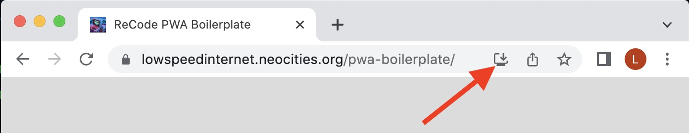

# Recode PWA Boilerplate

This repo is a Progressive Web App boilerplate for the [ReCode](https://billythemusical.github.io/recode-fa22) class. It provides the most basic functionality for a PWA, complete with the following necesary files:
- a service worker (sw.js)
    - functions as a intermediator between your installed app and the website to manage what files are installed locally on the client machine and grabs new files as updates are made
- a manifest.json file 
    - provides a list of the files and icons needed by the service worker along with other app-related metadata
    
All of the icon files were created with [favicon.ico](https://favicon.io/favicon-converter/)). 

> NOTE: The a2hs installer fork of this repo provides functionality for an install button on the page, which augments the 'normal' intall process in the URL window.

In order for this web app to be installed on your phone, you must serve the files via a website, like Neocities. However, you can install this on a desktop machine by serving the files locally. 

# Install Instructions

1) To clone this repo, `cd` to your target directory and type `git clone` and the repo link, which is this page's URL. You can also download the zipped contents as well. 

2) Run a local server from inside of the downloaded folder, for example, using the "Go Live" button in VS Code with Live-Server extension installed.

3) Then in your Chrome browser (recommended), navigate to the `localhost` page in your browser, being careful to note the port number (5500 in the case of Live-Server extension). 

4) You should be able to install the app by clicking the "Install" icon in the URL window (see pic below).  

Here are some helpful references, some of which were used to make this repo:
- [MDN PWA Examples](https://github.com/mdn/pwa-examples)
- [What Can PWA Do Today?](https://whatpwacando.today/)
- [Installing and Uninstalling PWA's on Chrome](https://support.google.com/chrome/answer/9658361?hl=en&co=GENIE.Platform%3DDesktop#zippy=%2Cuninstall-from-a-windows-mac-or-linux-computer)
- [Online Library of PWA's]()
- [Dress For The Weather](https://dev-d4w.glitch.me/)

